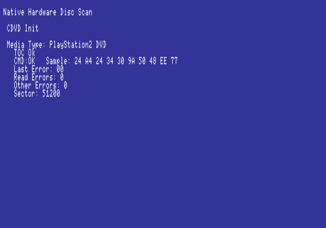

Exceptionally simplistic utility for the PlayStation2 that sequentially reads a disc's sectors and reports number of problems encountered.

# How to use with McFreeboot

1. Compile and place discscan.elf on a USB drive
2. Start uLaunch ELF
3. Place the disc in the tray and close it.
4. Navigate to discscan.elf and run it.
5. Wait for it to run, with any luck it'll read the whole disc without issues.

